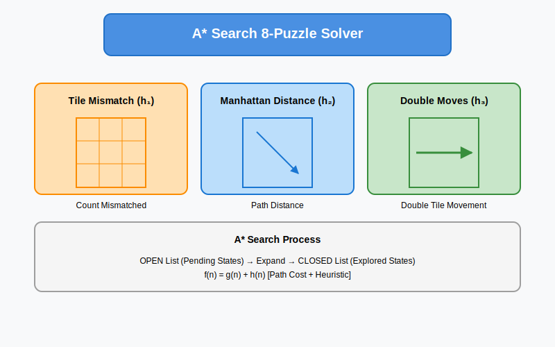

# A* Search 8-Puzzle Solver



A Java implementation of the A* search algorithm to solve the 8-puzzle problem using multiple heuristic approaches. This project demonstrates different search strategies and heuristic functions to find optimal solutions for the sliding tile puzzle.

## Features

### Multiple Heuristic Functions
- **Tile Mismatch (h₁)**: Counts misplaced tiles
- **Manhattan Distance (h₂)**: Sums the distances of tiles from their goal positions
- **Double Move Heuristic (h₃)**: Custom admissible heuristic for double-move scenarios

### Move Types
- **Single Moves**: LEFT, RIGHT, UP, DOWN
- **Double Moves**: DBL_LEFT, DBL_RIGHT, DBL_UP, DBL_DOWN

### Implementation Highlights
- A* search algorithm with OPEN and CLOSED lists
- Circular doubly-linked list data structure
- State space exploration with backtracking
- Solvability detection
- Multiple solution paths based on different heuristics

## Project Structure

```
src/
├── edu/iastate/cs472/proj1/
│   ├── EightPuzzle.java        # Main solver implementation
│   ├── State.java              # Puzzle state representation
│   ├── OrderedStateList.java   # OPEN/CLOSED list implementation
│   ├── Move.java               # Move types enumeration
│   ├── Heuristic.java          # Heuristic types enumeration
│   ├── StateComparator.java    # State comparison logic
│   └── PuzzleSolver.java       # Main class with UI
```

## Usage

1. **Compile the Code**
```bash
javac edu/iastate/cs472/proj1/*.java
```

2. **Run the Program**
```bash
java edu.iastate.cs472.proj1.PuzzleSolver
```

3. **Input Format**
Create a text file (e.g., `8Puzzle.txt`) with the initial state:
```
8 1 2
6 3 0
7 5 4
```

## Solution Example

```
Initial State:      Goal State:
8 1 2               1 2 3
6 3 0               8 0 4
7 5 4               7 6 5

Moves: RIGHT → DOWN → LEFT → LEFT → UP → UP → RIGHT → DOWN
```

## Implementation Details

### A* Search Algorithm
1. Initialize OPEN list with start state
2. While OPEN is not empty:
   - Remove best state from OPEN
   - If goal state, reconstruct path
   - Generate successors and update lists
3. Return optimal solution path

### Heuristic Functions

1. **Tile Mismatch (h₁)**
   ```java
   private int computeNumMismatchedTiles() {
       // Count tiles in wrong positions
   }
   ```

2. **Manhattan Distance (h₂)**
   ```java
   private int computeManhattanDistance() {
       // Sum of tile distances to goal positions
   }
   ```

3. **Double Move Heuristic (h₃)**
   ```java
   private int computeNumSingleDoubleMoves() {
       // Custom heuristic for double moves
   }
   ```

## Performance

- **Time Complexity**: O(b^d), where b is branching factor and d is solution depth
- **Space Complexity**: O(b^d) for storing states
- **Optimality**: Guaranteed with admissible heuristics


